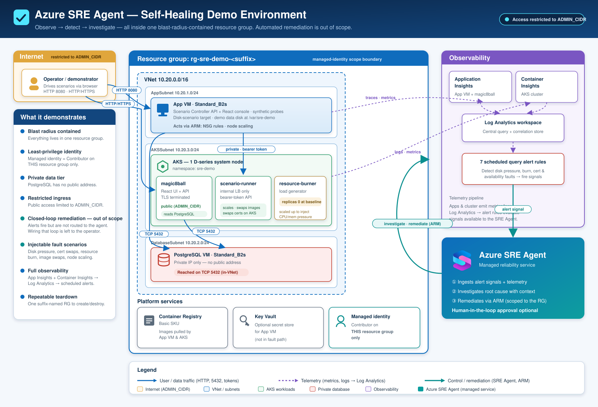
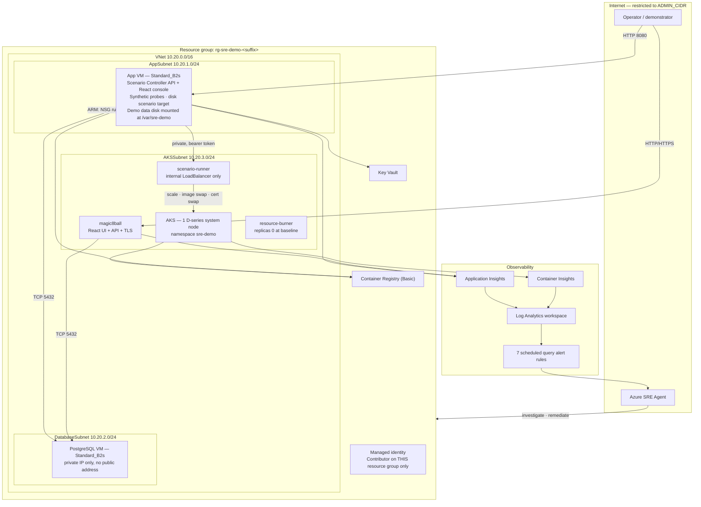

# Azure SRE Agent Demo Lab

A small, inexpensive, intentionally faultable Azure environment built to demonstrate how
**Azure SRE Agent** detects, investigates, diagnoses and remediates real operational incidents.

Six failure scenarios can be injected on demand from a web console, each producing a *genuine*
fault with genuine telemetry — a real full disk, real unschedulable pods, a real expired
certificate — and each resettable with one click.

---

## Contents

- [Purpose](#purpose)
- [Architecture](#architecture)
- [Applications](#applications)
- [Prerequisites](#prerequisites)
- [Quick start](#quick-start)
- [Azure resources](#azure-resources)
- [Estimated resource footprint](#estimated-resource-footprint)
- [Scenario Controller](#scenario-controller)
- [Magic 8 Ball](#magic-8-ball)
- [The six SRE scenarios](#the-six-sre-scenarios)
- [Azure SRE Agent setup](#azure-sre-agent-setup)
- [Running a demo](#running-a-demo)
- [Resetting](#resetting)
- [Stopping](#stopping)
- [Starting](#starting)
- [Destroying](#destroying)
- [Security](#security)
- [Cost considerations](#cost-considerations)
- [Troubleshooting](#troubleshooting)
- [Extending the demo](#extending-the-demo)

---

## Purpose

Demonstrating an AIOps agent is hard without something realistically broken to point it at.
Screenshots do not persuade an SRE audience, and breaking production is not an option.

This lab gives you a disposable environment where:

- **faults are real** — the disk genuinely fills, pods genuinely fail to schedule, the
  certificate genuinely expires, the NSG rule genuinely blocks traffic;
- **telemetry is real** — Azure Monitor, Log Analytics, Application Insights and Container
  Insights observe the consequences exactly as they would in production;
- **recovery is one click** — every scenario resets, and the whole lab resets, repeatedly and
  safely;
- **nothing else is at risk** — every fault is bounded to resources this lab created, and the
  control plane is deliberately built to survive whatever is broken.

The result is a demonstration you can run in front of a customer, hand to them to run
themselves, or use to train an on-call team.

---

## Architecture



<details>
<summary>Logical view (Mermaid)</summary>


</details>

**Design decisions worth knowing before you read the code:**

| Decision | Reason |
|---|---|
| Scenario Controller runs on a VM, not in AKS | The control plane must stay reachable when AKS, the database or the network path to them is the thing that is broken. |
| Cluster autoscaler is **disabled** | Scenario 02's expected remediation *is* scaling the node pool. An autoscaler would silently fix the incident, leaving nothing to investigate. |
| A dedicated 16 GB data disk for scenario 01 | Filling a dedicated disk is realistic; filling the OS disk would risk the very control plane needed to reset the lab. |
| Magic 8 Ball terminates TLS itself | No ingress controller to pay for or operate, and scenario 06 becomes a secret swap plus a rollout restart. |
| Two separately built Magic 8 Ball images | Scenario 03 must be a real deployment with a real version delta to correlate against, not a runtime feature flag that leaves no deployment trail. |
| Custom `sre_demo_*` metrics alongside native telemetry | Native signals stay authoritative; the custom metrics only shorten the detection window to something a live demo can accommodate. |

---

## Applications

| Application | Runs on | Purpose |
|---|---|---|
| **Scenario Controller** (React + Node/TypeScript) | App VM, Docker | Operations console. Injects, verifies and resets faults; runs synthetic monitoring; publishes custom telemetry. |
| **Magic 8 Ball** (React + Node/TypeScript) | AKS | The user-facing workload that degrades during a demo. Answers questions, stores history in PostgreSQL, degrades gracefully when the database is gone. |
| **scenario-runner** (Node/TypeScript) | AKS, internal only | Performs Kubernetes-local faults with a namespace-scoped RBAC Role. |
| **resource-burner** (Node) | AKS, 0 replicas at baseline | Bounded CPU and memory pressure for scenario 02. |

---

## Prerequisites

| Requirement | Notes |
|---|---|
| Azure subscription | With **Contributor** and **User Access Administrator**, or **Owner**, on the target subscription or a resource group you can create. |
| Azure CLI 2.60+ | `az login` completed. |
| `jq` | JSON processing in the scripts. |
| `openssl` 3.0+ | Generates the demo CA and certificates. |
| `kubectl` | Or let the script use `az aks install-cli`. |
| `git` | To clone the repository. |
| Bash | Linux/macOS natively; on Windows, Git Bash (bundled with Git for Windows) or WSL. |
| Regional quota | 8 vCPU headroom in the target region (4 for the VMs, 2 per AKS node, 2 for the scenario 02 remediation). |

Docker is **not** required locally — images are built in Azure with `az acr build`.

---

## Quick start

```bash
git clone https://github.com/F0bsterz/azure-sre-agent-demo-lab.git
cd azure-sre-agent-demo-lab

./scripts/deploy.sh --subscription <subscription-id> --location <azure-region>
```

PowerShell:

```powershell
.\scripts\deploy.ps1 -SubscriptionId <subscription-id> -Location <azure-region>
```

The deployment is idempotent — if it is interrupted, run it again.

To have the deployment also create an Azure SRE Agent, add `--with-agent` (see
[Azure SRE Agent setup](#azure-sre-agent-setup)). It is off by default.

By default, SSH, the Scenario Controller and Magic 8 Ball are restricted to **your current
public IP**. Override with `--admin-cidr 203.0.113.0/24` if you are demonstrating from
elsewhere.

When it finishes you get URLs for both applications and a `.lab-state.json` file (git-ignored)
that the other scripts read, so you never re-type connection details.

Verify everything:

```bash
./scripts/validate.sh
```

### Deploying it with GitHub Copilot

If you would rather have an agent drive it, paste the prompt below into Copilot Chat
(agent mode), the GitHub Copilot coding agent, or Copilot CLI. It is written to make the
agent ask you for the things it genuinely cannot know, and to stop rather than guess.

```text
Deploy the Azure SRE Agent demo lab into my own GitHub repository and Azure subscription.

1. Fork https://github.com/F0bsterz/azure-sre-agent-demo-lab into my account as a PRIVATE
   repository, clone it locally, and work on `main`.

2. Check my prerequisites first and tell me what is missing instead of installing things
   silently: Azure CLI 2.60+ already logged in via `az login`, plus `jq`, `openssl` 3.0+,
   `kubectl`, `git` and Bash. Docker is NOT required — images are built in Azure with
   `az acr build`.

3. Ask me for these and do not guess any of them:
   - the Azure subscription ID to deploy into;
   - the Azure region;
   - the public IP address I will BROWSE the demo from. This is frequently NOT the machine
     running the deployment. If they differ, pass `--admin-cidr` twice so both are allowed;
   - whether I want an Azure SRE Agent created as part of the deployment. If yes, add
     `--with-agent`, and ask which mode: ReadOnly, Review (default, pauses for approval) or
     Autonomous. The agent is chargeable, so never add this flag unless I ask for it.

4. Before deploying, confirm the region can actually take it:
   - I need roughly 8 vCPU of headroom there;
   - check the AKS node SKU is available:
     az vm list-skus --location <region> --resource-type virtualMachines \
       --query "[?name=='Standard_D2as_v7'].restrictions"
     Only restrictions of type "Location" block a deployment — zone-only restrictions do not.
   - if I asked for an agent, check the region offers one. SRE Agent is NOT available in
     eastus. deploy.sh validates this too, but tell me early:
     az provider show -n Microsoft.App \
       --query "resourceTypes[?resourceType=='agents'].locations[]"
   If the region is out of capacity, recommend a different region rather than retrying the
   same one.

5. Deploy, and stream the log so I can watch it:
     ./scripts/deploy.sh --subscription <id> --location <region> --admin-cidr <my-ip>/32
   It is long-running and idempotent — if it is interrupted, just run it again. While it is
   running, do NOT edit anything under scripts/: bash reads a script lazily as it executes,
   so editing a running script makes it run garbage.

6. When it completes, run ./scripts/validate.sh and show me the output. Report any failure
   honestly and diagnose it — do not re-run until it happens to look green.

7. Finally, print the Scenario Controller and Magic 8 Ball URLs from .lab-state.json, and
   remind me that this lab creates real, billed Azure resources and that
   ./scripts/destroy-lab.sh removes them when I am finished.

Creating the agent is scripted (step 3), but connecting it to GitHub needs interactive OAuth
consent, and granting it write access is a deliberate separate command. Point me at
docs/AZURE-SRE-AGENT-SETUP.md for both once the lab is up.
```

---

## Azure resources

| Resource | SKU / size | Purpose |
|---|---|---|
| Virtual network + 3 subnets + 3 NSGs | — | App, database and AKS isolation. Scenario 05 targets the database NSG. |
| App VM | `Standard_B2s`, Ubuntu 24.04 LTS | Scenario Controller, synthetic probes, disk scenario. |
| Demo data disk | 16 GB StandardSSD | Scenario 01 target, mounted at `/var/sre-demo`. |
| PostgreSQL VM | `Standard_B2s`, Ubuntu 24.04 LTS | Private-only database, `max_connections` 50. |
| PostgreSQL data disk | 32 GB StandardSSD | Cluster data directory. |
| AKS | 1 node, `Standard_D2as_v7` (validated per region) | Magic 8 Ball, scenario-runner, resource-burner. |
| Container Registry | Basic | Five lab images. Admin account disabled; pulls use Entra ID. |
| Log Analytics workspace | PerGB2018, 30-day retention, 2 GB/day cap | Single pane for all telemetry. |
| Application Insights | Workspace-based | Application requests, dependencies, exceptions, custom metrics. |
| Key Vault | Standard, RBAC | Generated database and runner credentials. |
| Managed identity | User-assigned | Contributor on **this resource group only**. |
| Alert rules | 7 scheduled query rules | One per scenario; scenario 02 has two (node pressure + pending pods). 5-minute evaluation. |
| Azure SRE Agent | `Microsoft.App/agents` | **Optional**, only with `--with-agent`. Created with its own user-assigned identity holding no roles. |

Every resource is tagged `project=azure-sre-agent-demo`, `environment=demo`,
`managedBy=bicep`, `purpose=sre-training`.

---

## Estimated resource footprint

Approximate US East list prices, for planning only — check the
[Azure pricing calculator](https://azure.microsoft.com/pricing/calculator/) for your region and
agreement.

| Component | Running | Stopped |
|---|---|---|
| 2 × B2s VMs | ~$0.10/hr | $0 |
| 1 × D2as_v7 AKS node | ~$0.10/hr | $0 |
| AKS control plane (Free tier) | $0 | $0 |
| Managed disks (~145 GB total) | ~$0.02/hr | ~$0.02/hr |
| 2 × Standard public IP, 2 × load balancer | ~$0.02/hr | ~$0.02/hr |
| Container Registry Basic | ~$0.007/hr | ~$0.007/hr |
| Log Analytics + App Insights | Usage-based, capped at 2 GB/day | Retention only |
| Key Vault | Negligible | Negligible |
| **Azure SRE Agent** (optional, `--with-agent`) | **~$0.40/hr** always-on, plus token-based usage | **~$0.40/hr — not stopped by `stop-lab.sh`** |

**Without an agent: roughly $0.25–0.35/hour running, and $0.04–0.05/hour stopped.** A two-hour
demo costs well under a dollar; leaving it deployed but stopped for a month costs a few dollars
in disks and IPs.

### The agent costs more than the rest of the lab

Azure SRE Agent bills in **Azure Agent Units (AAU)**, in two parts:

| Component | Rate | Notes |
|---|---|---|
| Always-on flow | 4 AAU/hour per agent, at $0.10/AAU = **$0.40/hour** | Fixed. The agent monitors and learns in the background whether or not you are demonstrating. |
| Active flow | Token-based, $0.10/AAU | Charged only while an investigation or remediation runs. |

So `--with-agent` roughly **triples** the running cost, to about **$0.65–0.75/hour**.

> **`stop-lab.sh` does not stop the agent.** It deallocates the VMs and stops AKS, but the agent
> has no stopped state — it keeps accruing the always-on charge, about **$10/day** or **$290/month**,
> even with the rest of the lab shut down. Between demos, either delete the agent
> (`az resource delete --ids "$(jq -r .sreAgentId .lab-state.json)"`) and recreate it later with
> `--with-agent`, or use `destroy-lab.sh`, which removes it along with everything else.

Check the [SRE Agent pricing page](https://azure.microsoft.com/pricing/details/sre-agent/) before
running a long-lived lab — there is periodically a trial that waives the always-on charge.

Use `./scripts/stop-lab.sh` between demos and `./scripts/destroy-lab.sh` when finished.

---

## Scenario Controller

The operations console, served from the App VM.

- **System health** — App VM, PostgreSQL, AKS, Magic 8 Ball and TLS, each with live status,
  detail and a sparkline.
- **Active incident** — what is broken, for how long, and when it will auto-reset.
- **Scenario cards** — ID, name, description, affected component, severity, state, activation
  time, elapsed timer, telemetry status, live metrics and verification results, with
  **Inject**, **Verify** and **Reset** on every card.
- **Incident history** — a timeline stored in PostgreSQL, buffered locally when PostgreSQL is
  the component that is down.
- **SRE prompts** — the suggested Azure SRE Agent prompt for each scenario, ready to copy.
- **Reset entire lab** — one button, safe to press at any time.

### API

```
GET  /api/health                      Controller liveness (no external dependencies)
GET  /api/version                     Build metadata
GET  /api/lab/status                  Aggregate health of every component
POST /api/lab/reset                   Reset every scenario
GET  /api/lab/timeline                Incident history

GET  /api/scenarios                   All scenarios with state
GET  /api/scenarios/{id}/status       One scenario
GET  /api/scenarios/{id}/telemetry    Live evidence for that scenario
POST /api/scenarios/{id}/activate     Inject the fault
POST /api/scenarios/{id}/verify       Confirm the environment matches the claimed state
POST /api/scenarios/{id}/reset        Clear the fault
POST /api/scenarios/02/scale          Scale the AKS node pool (scenario 02 remediation)
```

All scenario operations are idempotent.

---

## Magic 8 Ball

The workload the audience watches. React front end, Node API, PostgreSQL-backed history,
animated answer reveal, live service-health and latency indicators, and build metadata on
screen so a bad deployment is visible in the UI as well as in telemetry.

```
GET  /healthz        Liveness
GET  /readyz         Readiness (does not fail when the database is down — that is a degradation)
POST /api/answer     Ask a question
GET  /api/version    Version, image tag, git commit, build timestamp, variant
GET  /api/history    Recent questions and answers
```

---

## The six SRE scenarios

| # | Scenario | Component | What actually breaks | Expected remediation |
|---|---|---|---|---|
| 01 | [Disk capacity exhaustion](docs/scenarios/01-disk-exhaustion.md) | App VM | A retry storm floods `/var/sre-demo/logs` to ~88% | Stop the logger, remove the log files |
| 02 | [AKS resource exhaustion](docs/scenarios/02-aks-capacity.md) | AKS | Node CPU saturates at ~98% and 4 of 6 pods cannot be scheduled | Scale the node pool 1 → 2 |
| 03 | [Bad deployment](docs/scenarios/03-bad-deployment.md) | AKS | A regressed image returns ~42% HTTP 500 and 3–5s latency | Roll back to the stable image |
| 04 | [Database connection exhaustion](docs/scenarios/04-postgres-connections.md) | PostgreSQL | Leaked sessions approach `max_connections` | Terminate the leaked sessions, fix pooling |
| 05 | [Network / NSG failure](docs/scenarios/05-network-nsg.md) | Networking | An NSG rule blocks TCP 5432 only | Remove `sre-demo-deny-postgres` |
| 06 | [Certificate expiration](docs/scenarios/06-certificate-expiration.md) | AKS | An expired certificate replaces the valid one | Reinstall the valid certificate |

Each scenario document covers the story, activation, expected symptoms, the Azure alert,
investigation clues, root cause, remediation, recovery verification, manual reset and safety
limits.

### Safety rules

- **One scenario at a time** by default. Overlapping faults make an investigation ambiguous.
- **Automatic timeout** after 60 minutes, with an automatic safe reset.
- **Bounded blast radius** — every injected object is labelled `sre-demo-scenario=true` and
  `scenario-id=<id>`; nothing outside this lab is ever created, modified or deleted.
- **The control plane survives every scenario** — the disk scenario cannot touch the OS disk,
  the NSG scenario cannot block management traffic, and the database scenario always leaves
  administrative connection headroom.

---

## Azure SRE Agent setup

The lab can create the agent for you. It is **opt-in**, because an agent is a chargeable
managed service and is not offered in every region the rest of the lab runs in:

```bash
./scripts/deploy.sh --location eastus2 --with-agent --agent-mode Review
```

| Flag | Purpose |
|---|---|
| `--with-agent` | Also create a `Microsoft.App/agents` resource. Omitted, nothing is created and nothing changes. |
| `--agent-mode` | `ReadOnly` investigates only, `Review` (default) pauses for human approval before each remediation, `Autonomous` acts unattended. |
| `--agent-location` | Region for the agent when the lab region does not offer it. |

SRE Agent is not available in every region — notably **not in `eastus`**, which is the
default lab region. `deploy.sh` checks this up front and lists the regions that do offer it
rather than failing part-way through the deployment.

The agent is created with a system-assigned identity and **no role assignments**. Deploying
it does not grant it anything; access is a separate, deliberate step:

```bash
./scripts/enable-sre-remediation.sh --agent-principal-id <printed by deploy.sh>
```

**Your** access to the agent is handled automatically. Azure SRE Agent has a data plane with
its own roles, and subscription Owner grants none of them — without one the agent endpoint
returns 401 and the UI misreports it as a cold start. The deployment therefore assigns the
deploying principal **SRE Agent Administrator** on the agent. Others need it granted explicitly;
see [docs/AZURE-SRE-AGENT-SETUP.md](docs/AZURE-SRE-AGENT-SETUP.md).

On first sign-in the agent may offer to **migrate** from the Public Preview generation. Accept
it. The generation cannot be selected from a template — the properties behind it are
service-managed and ARM has no migrate operation — so it is a one-time click per agent.

See **[docs/AZURE-SRE-AGENT-SETUP.md](docs/AZURE-SRE-AGENT-SETUP.md)** for connecting this
repository, granting scoped access, verifying the agent can see Application Insights, Log
Analytics, Azure Monitor and AKS diagnostics, and running the first investigation.

The GitHub connector consent is interactive in most tenants. The lab deploys completely
without it and tells you precisely which step remains.

Permissions stay scoped to the demo resource group. The optional `enable-sre-remediation`
workflow grants Contributor **at that resource group only** — never subscription-wide.

---

## Running a demo

1. `./scripts/validate.sh` — confirm a green baseline.
2. Open the Scenario Controller and the Magic 8 Ball side by side.
3. Inject a scenario and confirm the dialog.
4. Watch the health grid degrade, typically within 30–60 seconds.
5. Wait 3–5 minutes for the Azure Monitor alert to fire.
6. Give Azure SRE Agent the suggested prompt from the **SRE prompts** tab.
7. Let the agent investigate; compare its findings with the scenario document.
8. Apply the remediation — through the agent, or with the button on the card.
9. Press **Verify** to confirm recovery.
10. Press **Reset** and move to the next scenario.

Full narrative for each scenario: **[docs/SRE-DEMO-RUNBOOK.md](docs/SRE-DEMO-RUNBOOK.md)**.

---

## Resetting

```bash
./scripts/reset-lab.sh          # or .\scripts\reset-lab.ps1
```

Stops the disk logger and removes only its files, removes the pressure workload, restores the
node pool baseline and the stable image, closes scenario database sessions, removes the NSG
deny rule and reinstalls the valid certificate. Safe to run repeatedly, and it works even when
the controller itself is unreachable.

## Stopping

```bash
./scripts/stop-lab.sh
```

Deallocates both VMs and stops AKS. Prints what still costs money while stopped.

## Starting

```bash
./scripts/start-lab.sh
```

Starts PostgreSQL, then AKS, then the App VM, then waits for both applications.

## Destroying

```bash
./scripts/destroy-lab.sh --dry-run   # review first
./scripts/destroy-lab.sh             # then delete
```

Deletes only the lab's resource group, and only if it carries the
`project=azure-sre-agent-demo` tag. Requires you to type the group name unless `--yes` is given.

---

## Security

Full detail in **[docs/SECURITY.md](docs/SECURITY.md)**. In summary:

- PostgreSQL has **no public IP** and is reachable only from the App and AKS subnets.
- SSH uses **keys only**; password authentication is disabled.
- Inbound access defaults to **your public IP**, never `0.0.0.0/0`.
- No secrets in source. Passwords are generated at deploy time and stored in Key Vault;
  database credentials reach the VM through encrypted extension settings and reach AKS as
  Kubernetes secrets.
- ACR admin account **disabled**; AKS and the App VM pull with Entra ID identities.
- The lab identity holds Contributor **on the demo resource group only**.
- `scenario-runner` uses a namespace-scoped Role, not cluster-admin, and is never exposed
  publicly.
- `.gitignore` covers `.env`, `certs/`, `.secrets/`, kubeconfig, keys and `.lab-state.json`.

> The demo CA and certificates in `certs/` are for this lab only. They are git-ignored,
> regenerated on every deployment, and must never be used for anything else.

---

## Cost considerations

- Everything is deliberately demo-sized: B-series VMs, one AKS node, Basic ACR, Free AKS tier,
  StandardSSD disks.
- Log Analytics is capped at **2 GB/day** to bound ingestion cost.
- No Application Gateway, Azure Firewall, NAT Gateway, premium disks, extra node pools or zone
  redundancy — all of which a production architecture would likely include. This is a
  demonstration environment, not a reference architecture; see
  [docs/ARCHITECTURE.md](docs/ARCHITECTURE.md) for what would change in production.
- `stop-lab` between demos; `destroy-lab` when finished.
- **The optional SRE Agent is the single largest line item** at ~$0.40/hour, and `stop-lab` does
  not stop it. Delete the agent or destroy the lab if it will sit idle. See
  [Estimated resource footprint](#estimated-resource-footprint).

---

## Troubleshooting

See **[docs/TROUBLESHOOTING.md](docs/TROUBLESHOOTING.md)**.

**Cannot reach the apps?** Access is restricted to whichever IP ran `deploy.sh`.
To allow another address (or after your IP changes):

```bash
./scripts/grant-access.sh                       # allow the machine you are on
./scripts/grant-access.sh --cidr 203.0.113.10/32
./scripts/grant-access.sh --cidr 203.0.113.10/32 --revoke
```

It adds to the existing allow-lists rather than replacing them, and covers SSH,
the Scenario Controller and the Magic 8 Ball load balancer in one step.

Quick checks:

```bash
./scripts/validate.sh                                    # full PASS/FAIL report
curl http://<app-vm-ip>:8080/api/lab/status | jq         # component health
export KUBECONFIG=.secrets/kubeconfig-<suffix>
kubectl -n sre-demo get pods,deploy,svc                  # cluster state
az vm run-command invoke -g <rg> -n <app-vm> \
  --command-id RunShellScript \
  --scripts "docker logs --tail 100 sre-scenario-controller"
```

---

## Extending the demo

Scenarios implement a single interface:

```typescript
interface SreScenario {
  id: string;
  name: string;
  activate(): Promise<ScenarioResult>;
  status():   Promise<ScenarioStatus>;
  telemetry():Promise<ScenarioTelemetry>;
  verify():   Promise<VerificationResult>;
  reset():    Promise<ScenarioResult>;
}
```

Add a class extending `BaseScenario`, register it in
`apps/scenario-controller/backend/src/scenarios/index.ts`, and the API, the dashboard, the
timeline and the lab-wide reset pick it up automatically.

Candidates for future scenarios: DNS failure, `CrashLoopBackOff`, memory leak, CPU runaway, VM
service crash, secret rotation failure, Key Vault access denial, storage latency, dependency
outage, HPA misconfiguration, expired credentials.

---

## Repository layout

```
apps/          scenario-controller and magic8ball (frontend + backend each)
services/      scenario-runner, resource-burner
infra/bicep/   main.bicep and modules
k8s/           namespace, workloads, RBAC
scripts/       deploy, validate, reset, stop, start, destroy (.sh and .ps1)
docs/          architecture, deployment, SRE agent setup, runbook, security,
               troubleshooting, and one document per scenario
tests/         template and manifest tests
```

---

## Licence

MIT. Provided as a demonstration environment; not intended for production use.
