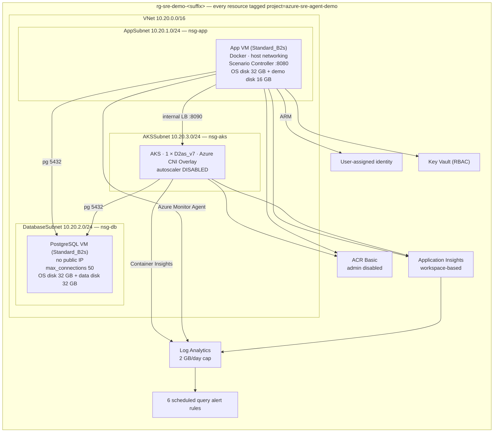
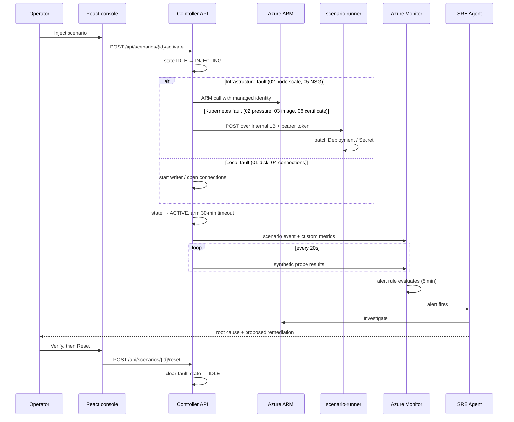
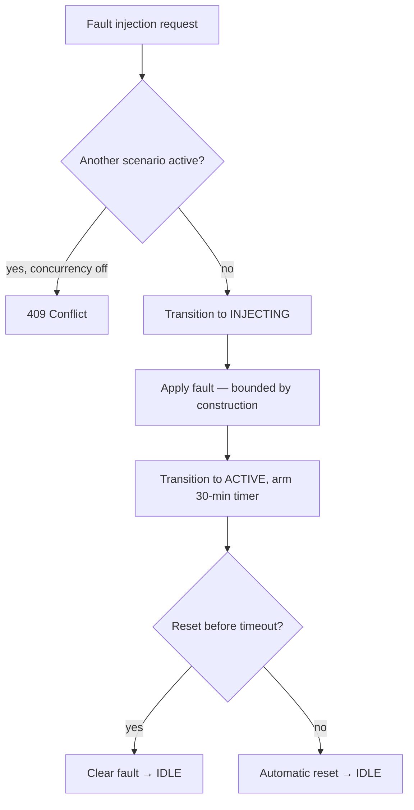

# Architecture

How the lab is built, and — more usefully — *why* it is built this way. Several choices here
would be wrong in production and are right for a demonstration environment; those are called out
explicitly.

---

## Design constraints

Everything below follows from five constraints:

1. **Faults must be real.** Simulated telemetry would prove nothing about an agent's ability to
   investigate. The disk genuinely fills, pods genuinely fail to schedule, the certificate is
   genuinely expired.
2. **The control plane must survive every fault.** If the operator loses the ability to reset,
   the lab is a liability rather than a tool.
3. **The blast radius must be provably bounded.** Anyone considering running this against their
   subscription must be able to satisfy themselves it cannot touch anything else.
4. **It must be cheap.** A demo environment that costs real money will not be left running.
5. **It must be portable.** No hardcoded subscription, tenant, region, resource ID, IP address,
   Kubernetes version or password.

---

## Component topology

---

## Why the control plane lives on a VM

The Scenario Controller could have run in AKS. It does not, and that is the single most
important structural decision in the lab.

Scenario 02 makes the cluster unable to schedule pods. Scenario 03 breaks the application in the
cluster. Scenario 06 breaks TLS in the cluster. If the controller lived there, each of those
would risk taking down the tool needed to undo them.

Placing it on a separate VM, in a separate subnet, with its own dependencies means:

- AKS can be saturated and the controller still responds;
- PostgreSQL can be unreachable and the controller still responds (buffering events locally);
- the network path to the database can be severed and the controller still responds.

This is the general principle that a control plane must not share a failure domain with the
thing it controls.

---

## Data flow during a scenario

---

## Telemetry design

Everything lands in **one Log Analytics workspace**. Workspace-based Application Insights writes
`AppRequests`, `AppDependencies`, `AppExceptions`, `AppMetrics` and `AppEvents` there; Container
Insights writes `Perf`, `KubePodInventory` and `ContainerLogV2`; the Azure Monitor Agent writes
guest `Perf` and `Syslog`.

A single correlated dataset is what makes an investigation tractable — for a human or an agent.

### Why telemetry is emitted directly rather than through the SDK

Both applications post Application Insights envelopes to the ingestion endpoint themselves.

The alert rules depend on precise table shapes and precise metric names. Emitting the envelopes
explicitly guarantees those shapes, keeps the runtime images free of transitive dependencies,
and removes a class of version-drift failures. The trade-off is losing automatic instrumentation
— which is why request, dependency and exception telemetry are recorded deliberately at each
call site instead.

### Custom metrics

| Metric | Emitted by | Purpose |
|---|---|---|
| `sre_demo_disk_percent_used` | Controller | Scenario 01 |
| `sre_demo_postgres_active_connections` | Controller | Scenario 04 |
| `sre_demo_postgres_connection_percent` | Controller | Scenario 04 alert |
| `sre_demo_postgres_connectivity` | Controller | Scenarios 04/05 |
| `sre_demo_postgres_latency_ms` | Controller | Dependency latency |
| `sre_demo_magic8ball_tls_valid` | Controller | Scenario 06 alert |
| `sre_demo_magic8ball_tls_days_remaining` | Controller | Proactive expiry warning |
| `sre_demo_magic8ball_http_success` | Controller | Scenario 03 |
| `sre_demo_aks_pending_pods` | Controller | Scenario 02 |
| `sre_demo_aks_node_count` | Controller | Scenario 02 |
| `sre_demo_scenario_active` | Controller | Which fault is live |

These **supplement** native telemetry; they do not replace it. Native infrastructure signals
remain authoritative — the custom metrics exist because a demo cannot wait fifteen minutes for a
platform metric to surface. The faults themselves are always real.

Every scenario event also carries `scenario.id`, `scenario.name`, `scenario.state`,
`scenario.startedAt`, `scenario.component` and `scenario.correlationId`.

---

## Fault injection paths

| Scenario | Mechanism | Executed by | Permission required |
|---|---|---|---|
| 01 Disk | Append to files on the demo mount | Controller, locally | None |
| 02 AKS capacity | Scale a Deployment 0 → 6; scale node pool | scenario-runner; controller via ARM | Namespace `patch deployments`; Contributor on the RG |
| 03 Bad deployment | Patch the Deployment image | scenario-runner | Namespace `patch deployments` |
| 04 DB connections | Open and hold labelled sessions | Controller, directly | Database login only |
| 05 NSG | Create one security rule | Controller via ARM | Contributor on the RG |
| 06 Certificate | Copy between existing secrets | scenario-runner | `get`/`patch` on three named secrets |

Three different mechanisms, each with the narrowest privilege that will do the job.

---

## Safety architecture

Bounds enforced in code, not by convention:

- **Disk** — 88% target, 92% hard ceiling, 256 MB free-space floor, writes confined to
  `/var/sre-demo/logs`, files individually named for the scenario.
- **AKS pressure** — replica cap in the runner, CPU/memory requests and limits per pod,
  namespace `ResourceQuota`, `LimitRange` maximum per container, negative `PriorityClass` with
  preemption disabled so application pods can never be evicted.
- **Database** — leak stops short of `max_connections` by the superuser reserve plus configured
  headroom; termination filters strictly on `application_name`.
- **Network** — one rule, one protocol, one port, two known source prefixes, one named NSG.
- **Certificate** — copies between three named secrets; key material never leaves the cluster.
- **Everything** — 30-minute automatic reset; one scenario at a time by default.

---

## Portability

No subscription, tenant, region, resource ID, IP address, Kubernetes version or password appears
in source. Specifically:

- resource names derive from a generated `suffix`;
- the AKS node SKU is validated against the target region at deploy time, with documented
  fallbacks, and only **Location**-type restrictions are treated as blocking (a zone restriction
  does not prevent a non-zonal deployment);
- the Kubernetes version is resolved from `az aks get-versions` at deploy time — no patch
  version is ever pinned;
- passwords are generated per deployment and stored in Key Vault;
- the administrator CIDR defaults to the deploying machine's detected public IP;
- load balancer addresses are discovered after provisioning, and the TLS certificates are
  reissued to cover the address actually assigned.

Clone, run `deploy.sh`, and it stands up in any subscription and region with capacity.

---

## Deliberately demo-sized

What this lab does, and what a production system would do instead:

| Area | This lab | Production |
|---|---|---|
| Database | PostgreSQL on a VM | Azure Database for PostgreSQL Flexible Server, zone-redundant HA, PITR |
| AKS nodes | 1 node, single pool | Multiple pools, multiple zones, autoscaler enabled |
| AKS API server | Public | Private cluster or API server VNet integration |
| Ingress | TLS in the app, public LB | Application Gateway/WAF or an ingress controller with cert-manager |
| Certificates | Private demo CA | Public CA, automated issuance and rotation |
| Egress | Load balancer | NAT Gateway with deterministic outbound addresses |
| Registry | Basic, public endpoint | Premium, private endpoint, geo-replication, content trust |
| Secrets | Key Vault + Kubernetes secrets | Key Vault with the CSI driver and workload identity |
| VM sizing | Burstable B-series | Non-burstable, right-sized from measurement |
| Disks | StandardSSD | Premium SSD v2 or Ultra where warranted |
| Log retention | 30 days, 2 GB/day cap | Per compliance requirement |
| Alert routing | No action groups | Action groups into the on-call system |
| Resilience | Single region | Multi-region with tested failover |

Omissions that are choices, not oversights: no Application Gateway, Azure Firewall, NAT Gateway,
premium disks, additional node pools or zone redundancy — each would add cost without teaching
anything about incident investigation.

**Two exceptions that are correct here for demo reasons and would be wrong in production:**

- the **cluster autoscaler is disabled**, so scenario 02 has an incident to investigate;
- **`max_connections` is unusually low**, so scenario 04 saturates in seconds.

---

## Extensibility

Scenarios implement one interface and extend `BaseScenario`, which provides persisted state,
transitions, event recording, telemetry and the safety timeout. Registering a new class in
`scenarios/index.ts` is the only wiring required — the API, dashboard, timeline and lab-wide
reset all iterate the registry.

State model: `IDLE → INJECTING → ACTIVE → DETECTED → MITIGATING → RECOVERED → RESETTING`.

State is persisted to the demo disk so a controller restart mid-incident does not lose track of
an active fault, and mirrored in memory so a full disk cannot wedge the control plane.
