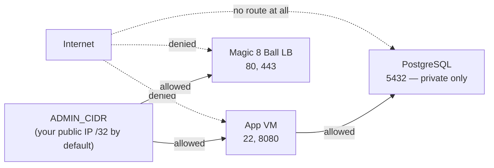

# Security

This lab deliberately breaks things, and it runs in someone's real Azure subscription. Both
facts make its security posture worth stating precisely.

Two questions are answered here: **what protects the lab**, and **what protects everything
outside the lab from it**.

---

## Threat model

This is a demonstration environment, not a production system. It assumes:

- a single trusted operator running it in a subscription they control;
- a short lifetime — hours or days, not months;
- no real data, no real users, no production dependencies.

It does **not** assume the network is friendly. Inbound access is restricted by default, the
database is unreachable from the Internet, and no credential is ever committed.

---

## Network security



| Control | Implementation |
|---|---|
| PostgreSQL has **no public IP** | The VM is created without one; there is no inbound path from the Internet |
| Database reachable only from demo workloads | `nsg-db` allows 5432 from the app and AKS subnets only, with an explicit catch-all deny for all other VNet traffic |
| SSH restricted | Port 22 from `ADMIN_CIDR` only, on the App VM only |
| Database VM SSH | From the app subnet only — it is a bastion path, not an Internet path |
| Controller UI restricted | Port 8080 from `ADMIN_CIDR` only |
| Magic 8 Ball restricted | `loadBalancerSourceRanges` set to `ADMIN_CIDR` |
| scenario-runner never public | Internal load balancer only, annotated `azure-load-balancer-internal` |
| No default-open fallback | If the public IP cannot be detected and no `--admin-cidr` is given, the deployment **refuses to proceed** rather than defaulting to `0.0.0.0/0` |

Setting `ADMIN_CIDR=0.0.0.0/0` is possible and prints a warning. Do not do it on a subscription
you care about.

---

## Identity and access

**No passwords, anywhere, for Azure access.**

| Principal | Access | Scope |
|---|---|---|
| App VM user-assigned identity | Contributor | **The demo resource group only** |
| App VM identity | AcrPull | The lab registry only |
| App VM identity | Key Vault Secrets User | The lab vault only |
| AKS kubelet identity | AcrPull | The lab registry only |
| Deploying user | Key Vault Secrets Officer | The lab vault only |
| `scenario-runner` service account | Namespace Role | `sre-demo` namespace only |
| `scenario-runner` service account | Read-only ClusterRole | Nodes (unavoidable: Nodes are not namespaced) |
| SRE Agent user-assigned identity | **None at creation** | Granted separately, resource group only |

**Why Contributor at all?** Scenario 05 creates and deletes an NSG rule, and scenario 02 scales
the AKS node pool. Both are write operations against Azure Resource Manager. The grant is at
resource-group scope, so the identity cannot touch anything else in the subscription.

**The SRE Agent starts with nothing.** `--with-agent` creates the agent with its own dedicated
user-assigned identity and zero role assignments — deliberately not the lab identity, which
already holds Contributor and would have handed the agent write access as a side effect of
deploying. Access is granted only when you run `scripts/enable-sre-remediation.sh`, and revoked
with `--revoke`.

**Nothing is granted at subscription scope.** Not during deployment, not for the SRE Agent, not
for remediation.

### Kubernetes RBAC

`scenario-runner` can modify workloads, so its permissions are enumerated rather than broad:

```yaml
- apiGroups: ["apps"]
  resources: ["deployments"]
  verbs: ["get", "list", "patch", "update"]
- apiGroups: [""]
  resources: ["secrets"]
  resourceNames: [magic8ball-tls, magic8ball-tls-valid, magic8ball-tls-expired]
  verbs: ["get", "patch", "update"]
```

Note `resourceNames` on secrets: the runner can read and patch **exactly three named secrets**
and no others. It has no `create` or `delete` verb on anything, and no cluster-admin binding.

---

## Secrets management

**Never committed:** passwords, access keys, private certificates, service principal secrets,
kubeconfig, PAT tokens, `.env`, Azure credentials.

`.gitignore` covers `.env`, `certs/`, `.secrets/`, `*.pem`, `*.key`, `*.pfx`, `kubeconfig`,
`id_rsa*` and `.lab-state.json`. `.env.example` documents every setting and contains no secret
values.

### How each secret is handled

| Secret | Generated | Stored | Delivered |
|---|---|---|---|
| PostgreSQL app password | At deploy time, 32 chars from `/dev/urandom` | Key Vault | Bicep `@secure()` parameter → custom script extension **protectedSettings** (encrypted at rest by Azure); Kubernetes secret for AKS |
| PostgreSQL scenario password | At deploy time | Key Vault | Same |
| scenario-runner token | At deploy time | Key Vault | Kubernetes secret, plus the controller's env file (mode 0600) |
| SSH private key | At deploy time, ed25519 | `.secrets/` locally, mode 0600 | Public half only goes to Azure |
| TLS private keys | At deploy time by the demo CA | `certs/` locally, mode 0600 | Kubernetes TLS secrets |
| App Insights connection string | By Azure | Bicep `@secure()` output | Kubernetes secret and the controller env file |

**Why `protectedSettings` rather than cloud-init:** `customData` is readable by anyone who can
log into the VM and by anyone who can read the VM's model. Custom script extension
`protectedSettings` is encrypted at rest and not returned by the API. Non-secret bootstrap
(packages, disk mounting) goes in cloud-init; anything credential-bearing goes in
`protectedSettings`.

**ACR admin account is disabled.** There is no registry password to leak — AKS and the App VM
both authenticate with Entra ID identities.

---

## Container security

Both application images:

- run as a **non-root** user (`sre`, created in the image);
- use multi-stage builds, so no build toolchain or source ships in the runtime layer;
- are based on `node:22-alpine`;
- use `tini` as PID 1 for correct signal handling and zombie reaping.

Kubernetes workloads additionally set:

```yaml
securityContext:
  runAsNonRoot: true
  seccompProfile: { type: RuntimeDefault }
  allowPrivilegeEscalation: false
  readOnlyRootFilesystem: true
  capabilities: { drop: ["ALL"] }
```

`readOnlyRootFilesystem` with an `emptyDir` at `/tmp` — the applications write nothing to their
own filesystem.

---

## Blast radius: what the lab can and cannot touch

This is the part worth scrutinising before running it anywhere real.

**Can:**

- create, modify and delete resources inside its own resource group;
- add and remove one NSG rule (`sre-demo-deny-postgres`) on its own database NSG;
- scale its own AKS node pool between 1 and 5;
- patch Deployments and three named secrets inside its own `sre-demo` namespace;
- write files under `/var/sre-demo/logs` on its own App VM;
- open PostgreSQL sessions labelled `sre-demo-scenario-04` against its own database.

**Cannot:**

- touch any resource outside its resource group — no permission exists;
- touch any other NSG, VNet, cluster or VM;
- delete anything it did not create;
- fill the OS disk of any VM;
- terminate database sessions belonging to anything but itself;
- evict application pods (the burner has negative priority and preemption disabled);
- consume more than the namespace `ResourceQuota`;
- exceed 92% disk utilisation or fall below 256 MB free;
- run unattended for more than 60 minutes without automatically resetting.

`destroy-lab.sh` additionally **refuses to delete a resource group** that does not carry the
`project=azure-sre-agent-demo` tag, and requires the group name to be typed unless `--yes` is
passed. Subscription-scope deletion is never used.

---

## The demo certificate authority

`scripts/gen-certs.sh` creates a private CA and two server certificates.

- It exists **only** so scenario 06 can present a genuinely expired certificate without needing
  a domain, DNS control or a purchase.
- It is generated fresh on every deployment and written to `certs/`, which is git-ignored.
- Private keys are mode 0600.
- It is trusted **only** by the lab's own synthetic checker — nothing installs it into a system
  trust store.
- It signs one name: `magic8ball.sre-demo.local`, plus the load balancer IP.

Do not reuse this CA for anything. Delete `certs/` when finished.

---

## What is deliberately not hardened

Honest accounting of demo-appropriate compromises:

| Compromise | Why acceptable here | Production alternative |
|---|---|---|
| AKS API server is public | Private clusters need a jump host or VPN, which triples setup cost | Private cluster or API server VNet integration |
| AKS local accounts enabled | `az aks get-credentials --admin` keeps scripting reliable | Entra ID + Azure RBAC, local accounts disabled |
| ACR public endpoint | Private endpoints need DNS integration | Premium ACR with a private endpoint |
| Key Vault public endpoint, `defaultAction: Allow` | Private endpoints add cost and DNS complexity | Private endpoint, firewall enabled |
| Key Vault purge protection **off** | Otherwise the vault name is unusable for 90 days after teardown, blocking redeploy | Purge protection on |
| PostgreSQL on a VM | A managed instance cannot be broken in the ways scenario 04 requires | Azure Database for PostgreSQL Flexible Server |
| Log Analytics public ingestion | Private Link adds cost | Private Link scope |
| No action groups on alerts | Avoids paging anyone during a demo | Action groups into the on-call system |

Each is a conscious trade-off for a short-lived environment holding no real data.

---

## Operational guidance

- Deploy into a **non-production subscription**, ideally a dedicated sandbox.
- Keep `ADMIN_CIDR` at your own IP.
- Run `./scripts/stop-lab.sh` between demos and `./scripts/destroy-lab.sh` when finished.
- Delete `certs/` and `.secrets/` after teardown — `destroy-lab.sh` leaves them deliberately, so
  removal is your explicit choice.
- Keep SRE Agent access read-only unless actively demonstrating remediation, and revoke
  Contributor afterwards.
- Rotate nothing — instead, destroy and redeploy. Every credential is regenerated.

---

## Reporting a problem

This is demonstration software. If you find a security issue in it, open an issue in the
repository. Do not use it as the basis of a production system without a full review.
