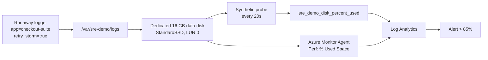

# Scenario 01 — Disk capacity exhaustion

| | |
|---|---|
| **ID** | 01 |
| **Component** | App VM — `/var/sre-demo` |
| **Severity** | High |
| **Alert rule** | `SRE Demo 01 - App VM demo disk capacity` |
| **Time to symptom** | 60–90 seconds |
| **Time to alert** | 3–5 minutes |

---

## The story

A payment integration starts timing out. The client library retries, and each retry logs an
error with a full stack trace. Nobody notices, because the service is still technically
serving traffic.

Twelve hours later the volume holding application logs is nearly full. Log writes begin
failing, then anything else that needs to write to that volume fails too — and the incident
that reaches on-call is not "the payment integration is flaky" but "the application VM is
out of disk".

This is one of the most common infrastructure incidents there is, and one of the most
commonly misdiagnosed: the obvious fix (make the disk bigger) treats the symptom and
guarantees a repeat.

---

## Architecture involved



The App VM has **two** disks: a 32 GB OS disk and a dedicated 16 GB data disk mounted at
`/var/sre-demo`. Only the data disk is ever touched.

---

## How to activate

**Console:** scenario card 01 → **Inject failure** → confirm.

**API:**

```bash
curl -X POST http://<app-vm-ip>:8080/api/scenarios/01/activate
```

The controller starts a background writer that appends realistic application log lines to
`/var/sre-demo/logs/sre-demo-scenario-01-<timestamp>.log`, rolling to a new file every ~64 MB
so that "which files are largest" is a meaningful question.

---

## Expected symptoms

| Where | What you see |
|---|---|
| Scenario Controller | App VM card goes DEGRADED then UNHEALTHY within seconds |
| `df -h /var/sre-demo` | Use% rises to ~88% and stops |
| Application Insights | `sre_demo_disk_percent_used` crosses 85 |
| Log Analytics `Perf` | `% Used Space` for `/var/sre-demo` rises |
| The VM | Nothing else is affected — the OS disk, Docker and the controller are all fine |

---

## Expected Azure alert

**`SRE Demo 01 - App VM demo disk capacity`**, severity 2, evaluated every 5 minutes over a
10-minute window:

```kusto
let custom = AppMetrics
    | where Name == "sre_demo_disk_percent_used"
    | extend Value = iif(ItemCount > 0, Sum / ItemCount, Sum)
    | project TimeGenerated, Computer = tostring(Properties["host"]), Value;
let guest = Perf
    | where ObjectName == "Logical Disk" and CounterName == "% Used Space"
    | where InstanceName startswith "/var/sre-demo"
    | project TimeGenerated, Computer, Value = CounterValue;
union custom, guest
| summarize DiskPercentUsed = max(Value)
```

The rule unions the custom metric with the guest performance counter, so it still fires if
either source is delayed.

---

## Investigation clues

Useful queries for an investigating agent or engineer:

```kusto
// Utilisation trend — note the shape: linear growth, not a spike
AppMetrics
| where Name == "sre_demo_disk_percent_used"
| extend Value = iif(ItemCount > 0, Sum / ItemCount, Sum)
| summarize avg(Value) by bin(TimeGenerated, 1m)
| render timechart
```

```kusto
// The scenario announces itself in structured events
AppEvents
| where Name == "sre_demo_scenario_transition"
| where Properties["scenario.id"] == "01"
| project TimeGenerated, Properties["scenario.state"], Properties["scenario.message"]
```

On the VM:

```bash
df -h /var/sre-demo                              # utilisation and mount point
du -sh /var/sre-demo/logs                        # the growing directory
ls -lhS /var/sre-demo/logs | head               # largest files first
head -3 /var/sre-demo/logs/sre-demo-scenario-01-*.log
```

A sample log line — the attribution is deliberately present in the data:

```
2026-08-27T10:15:04.123Z ERROR [payment-gateway] request_id=8f3a... session_id=b21c...
  app=checkout-suite msg="request failed" endpoint=/api/payments status=503
  exception="RetryExhaustedException: retry budget exhausted after 5 attempts" retry_storm=true
```

**The chain of reasoning:** disk full → one directory growing → files named for one scenario →
lines attributed to `app=checkout-suite` → `retry_storm=true` and `RetryExhaustedException` →
the cause is a retry loop, not a capacity shortfall.

---

## Expected root cause

An application in a retry storm is writing error logs at roughly 5–6 MB/s to
`/var/sre-demo/logs`. The disk is not undersized; the log volume is abnormal.

A complete answer names both the immediate cause (runaway logging) and the underlying trigger
(retries without a budget or backoff, and no log rotation on that volume).

---

## Expected remediation

**Immediate**

1. Stop the runaway logger.
2. Archive or delete its files to reclaim capacity.
3. Confirm utilisation is back below the threshold.

**Root cause**

- Cap the retry budget and apply exponential backoff with jitter.
- Configure `logrotate` for `/var/sre-demo/logs` with size limits and retention.
- Alert on log *growth rate*, not only on absolute utilisation — growth is the earlier signal.
- Downgrade retry attempts from ERROR to WARN.

---

## How to verify recovery

**Console:** press **Verify** on the card. All four checks should pass:

| Check | Passing condition |
|---|---|
| Demo disk mounted | `/var/sre-demo` reports its full capacity |
| Disk below alert threshold | Utilisation < 80% |
| Scenario log files removed | Zero files matching `sre-demo-scenario-01-*` |
| Disk never filled to capacity | Utilisation < 95% at all times |

**Manually:**

```bash
curl -s http://<app-vm-ip>:8080/api/scenarios/01/telemetry | jq
ssh -i .secrets/lab_<suffix>_ed25519 sreadmin@<app-vm-ip> 'df -h /var/sre-demo'
```

---

## How to reset manually

**Console:** **Reset** on the card, or **Reset entire lab**.

**API:**

```bash
curl -X POST http://<app-vm-ip>:8080/api/scenarios/01/reset
```

**Directly on the VM**, if the controller is unavailable:

```bash
ssh -i .secrets/lab_<suffix>_ed25519 sreadmin@<app-vm-ip>

# Delete ONLY files this scenario created
sudo rm -f /var/sre-demo/logs/sre-demo-scenario-01-*.log
df -h /var/sre-demo

# If the writer is still running, restart the controller
sudo docker restart sre-scenario-controller
```

> Delete only files matching `sre-demo-scenario-01-*.log`. Never `rm -rf /var/sre-demo/logs`
> wholesale — the same directory is where a real application would be writing.

---

## Safety limits

| Limit | Value | Why |
|---|---|---|
| Target utilisation | 88% (`DISK_SCENARIO_TARGET_PERCENT`) | Realistic pressure without exhaustion |
| Hard ceiling | 92% | Enforced in code regardless of configuration |
| Free-space floor | 256 MB | Absolute reserve, independent of percentage |
| Write location | `/var/sre-demo/logs` only | Never the OS disk, never outside the demo mount |
| File naming | `sre-demo-scenario-01-*.log` | Reset can identify exactly what it created |
| Automatic timeout | 60 minutes | Unattended scenarios self-reset |

**Why a dedicated disk.** Filling the OS disk would risk Docker, the Azure Monitor Agent, SSH
and the Scenario Controller itself — the very tools needed to diagnose and reset the lab. A
separate data disk keeps the fault realistic while guaranteeing the control plane survives it.
This is the same reasoning that puts `/var/log` on its own volume in production.

---

## Suggested SRE Agent prompt

```
Investigate why the application VM is reporting low disk capacity.
Identify the root cause and propose a safe mitigation.
```
