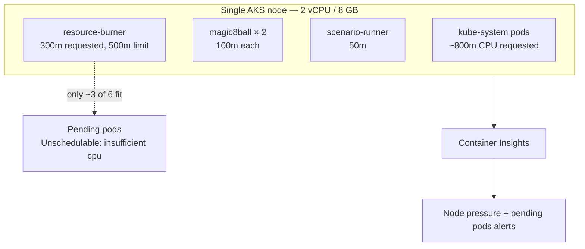

# Scenario 02 — AKS resource exhaustion

| | |
|---|---|
| **ID** | 02 |
| **Component** | AKS — `sre-demo` namespace |
| **Severity** | High |
| **Alert rules** | `SRE Demo 02 - AKS node resource pressure`, `SRE Demo 02 - AKS pods cannot be scheduled` |
| **Time to symptom** | 30–60 seconds |
| **Time to alert** | 3–5 minutes |

---

## The story

A team ships a new batch processing workload. It was sized on a developer's laptop, so its
resource requests are generous. It is deployed to a cluster that had exactly enough headroom
for what was already there.

The batch pods cannot all be scheduled. Some sit Pending. The ones that do schedule saturate
the node's CPU, and the customer-facing service sharing that node starts responding slowly.

The page that fires says "Magic 8 Ball is degraded". The cause is that something else moved in
next door.

---

## Architecture involved



Roughly 1.1 cores remain after system workloads. At 300m per replica only about three burner
replicas can be scheduled; the rest stay Pending.

**The cluster autoscaler is disabled deliberately.** With it enabled, the cluster would quietly
add a node and there would be no incident to investigate — which is itself worth discussing,
since it is why capacity problems in autoscaled clusters usually surface only at the
autoscaler's own ceiling.

---

## How to activate

**Console:** scenario card 02 → **Inject failure**.

**API:**

```bash
curl -X POST http://<app-vm-ip>:8080/api/scenarios/02/activate
```

The controller calls `scenario-runner`, which scales the pre-deployed `resource-burner`
Deployment from 0 to 6 replicas. Nothing is created — only scaled — which is what makes both
activation and reset idempotent.

---

## Expected symptoms

| Where | What you see |
|---|---|
| Scenario Controller | AKS card DEGRADED, pending pod count > 0 |
| `kubectl top node` | Node CPU at 95-100% |
| `kubectl get pods -n sre-demo` | 2 `resource-burner-*` Running, 4 `Pending` |
| `kubectl describe pod` | `FailedScheduling: 0/1 nodes are available: 1 Insufficient cpu` |
| Container Insights | Node CPU approaching 100%, memory working set climbing |

> Magic 8 Ball keeps answering, and quickly. Its own workload is tiny, so CFS
> still gives it the slice it asks for. What degrades is the cluster's ability to
> place *new* work — which is the honest lesson here: a saturated node does not
> always look like a slow application, and "the app is fine" is not evidence that
> the cluster is.

---

## Expected Azure alerts

**`SRE Demo 02 - AKS node resource pressure`** — fires when node CPU or memory utilisation
exceeds 80%:

```kusto
let cpuCapacity = Perf | where ObjectName == "K8SNode" and CounterName == "cpuCapacityNanoCores"
    | summarize Capacity = max(CounterValue) by Computer;
let cpuUsage = Perf | where ObjectName == "K8SNode" and CounterName == "cpuUsageNanoCores"
    | summarize Used = avg(CounterValue) by Computer;
cpuUsage | join kind=inner cpuCapacity on Computer
| where Capacity > 0
| summarize NodePressurePercent = max(100.0 * Used / Capacity)
```

**`SRE Demo 02 - AKS pods cannot be scheduled`** — fires on one or more Pending pods:

```kusto
KubePodInventory
| where Namespace == "sre-demo"
| summarize arg_max(TimeGenerated, PodStatus) by Name
| summarize PendingPods = countif(PodStatus == "Pending")
```

Two rules rather than one, because "the node is busy" and "work cannot be placed" are different
conditions that happen to coincide here — and distinguishing them is part of the diagnosis.

---

## Investigation clues

```kusto
// Node CPU as a percentage of capacity
Perf
| where ObjectName == "K8SNode" and CounterName in ("cpuUsageNanoCores", "cpuCapacityNanoCores")
| summarize Value = avg(CounterValue) by CounterName, bin(TimeGenerated, 1m)
| evaluate pivot(CounterName, any(Value))
| extend CpuPercent = 100.0 * cpuUsageNanoCores / cpuCapacityNanoCores
| render timechart
```

```kusto
// What is Pending, and why
KubePodInventory
| where Namespace == "sre-demo" and PodStatus == "Pending"
| summarize arg_max(TimeGenerated, *) by Name
| project Name, PodStatus, ContainerStatusReason, Computer
```

```bash
kubectl -n sre-demo get pods -o wide
kubectl -n sre-demo describe pod <pending-pod> | tail -20
kubectl describe node | grep -A8 "Allocated resources"
kubectl get nodes -o custom-columns=NAME:.metadata.name,CPU:.status.allocatable.cpu,MEM:.status.allocatable.memory
kubectl -n sre-demo top pods
```

**The chain of reasoning:** app degraded → node CPU saturated → pods Pending →
`Insufficient cpu` → requested exceeds allocatable → one node, autoscaler off → add capacity.

---

## Expected root cause

The `sre-demo` namespace requests more CPU than the single-node cluster can allocate. Pods that
cannot be placed stay Pending; those that are placed contend for CPU with Magic 8 Ball, which
degrades it.

The cluster is under-provisioned for the workload now deployed on it. The cluster autoscaler is
disabled, so nothing corrects this automatically.

---

## Expected remediation

**Primary — scale the node pool from 1 to 2:**

```bash
az aks nodepool scale \
  --resource-group <rg> \
  --cluster-name <aks> \
  --name system \
  --node-count 2
```

Or press **Scale AKS to 2** on the scenario card, or:

```bash
curl -X POST http://<app-vm-ip>:8080/api/scenarios/02/scale \
  -H 'content-type: application/json' -d '{"nodeCount":2}'
```

A new node takes 2–4 minutes to join and become Ready.

**Alternatives an agent might reasonably propose:**

- Right-size the batch workload's requests — cheaper, but only correct if the requests are wrong.
- Enable the cluster autoscaler — the right long-term answer, and worth discussing as such.
- Evict the batch workload — fastest, but it does not address why it was deployed there.

---

## How to verify recovery

| Signal | Recovered value |
|---|---|
| Pending pods | 0 |
| Node CPU | Below 80% |
| Magic 8 Ball replicas | 2/2 Ready |
| Magic 8 Ball replicas | 2/2 Ready |
| AKS card | HEALTHY |

```bash
kubectl -n sre-demo get pods
kubectl get nodes
curl -s http://<app-vm-ip>:8080/api/scenarios/02/telemetry | jq
```

---

## How to reset manually

**Console:** **Reset** on the card.

**API:**

```bash
curl -X POST http://<app-vm-ip>:8080/api/scenarios/02/reset
```

**Directly:**

```bash
export KUBECONFIG=.secrets/kubeconfig-<suffix>
kubectl -n sre-demo scale deployment/resource-burner --replicas=0

az aks nodepool scale -g <rg> --cluster-name <aks> -n system --node-count 1
```

Reset removes the pressure workload **and** returns the node pool to the baseline, so a demo
does not silently leave a second node billing.

---

## Safety limits

| Limit | Value | Why |
|---|---|---|
| Maximum burner replicas | 8 (`MAX_BURNER_REPLICAS`) | Enforced by scenario-runner, whatever is requested |
| CPU request / limit | 100m / 900m | Two replicas fit; each is still capped below a full core |
| Memory request / limit | 256Mi / 512Mi | Fixed allocation, no leak |
| Namespace ResourceQuota | 4 CPU / 6Gi requests | Hard ceiling for everything in `sre-demo` |
| LimitRange max per container | 1 CPU / 1Gi | No single container can request more |
| PriorityClass | `sre-demo-low-priority`, value −10, preemption **Never** | The burner can never evict Magic 8 Ball or scenario-runner |
| Node floor on reset | Never below baseline | Reset cannot leave the lab smaller than it started |
| Automatic timeout | 30 minutes | Unattended scenarios self-reset |

**Why the burner cannot run away.** It is a single process that allocates a fixed buffer once
and burns CPU on a duty cycle — it never forks, never recurses and never grows. The pressure
that makes pods Pending comes from Kubernetes *requests*, not from actual consumption, which is
what makes the fault both realistic and completely bounded.

**Why the quota is generous.** If the ResourceQuota rejected the replicas, the ReplicaSet would
report `FailedCreate` and there would be no scheduling incident at all. The quota admits them;
the node's allocatable capacity is what constrains them. That difference is deliberate — and is
the reason scaling the node pool is the correct fix.

---

## Suggested SRE Agent prompt

```
Investigate why Magic 8 Ball is degraded and whether the AKS
cluster has sufficient compute capacity.
```
