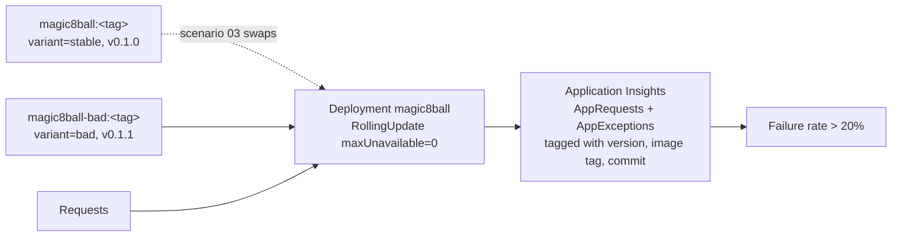

# Scenario 03 — Bad application deployment

| | |
|---|---|
| **ID** | 03 |
| **Component** | AKS — `magic8ball` Deployment |
| **Severity** | Critical |
| **Alert rule** | `SRE Demo 03 - Magic 8 Ball HTTP failure rate` |
| **Time to symptom** | 20–40 seconds (rollout time) |
| **Time to alert** | 3–5 minutes |

---

## The story

A release goes out. It passed CI, it passed review, and the rollout reports success — every pod
is Ready, because the liveness probe still answers.

Minutes later, error rates climb. Roughly two in five requests return HTTP 500, and the
successful ones take three to five seconds instead of fifty milliseconds. Nothing about the
infrastructure has changed.

The whole question is: *which change caused this, and how fast can we get back?* That is
answerable in seconds if deployments are correlated with telemetry, and takes an hour of
guesswork if they are not.

---

## Architecture involved



Two images are built from identical source. They differ only in build metadata and a
`FAULT_MODE` build argument. That matters: the rollback is a genuine image change with a
genuine version delta to correlate against, rather than a runtime feature flag that would leave
no deployment trail for an investigation to find.

---

## How to activate

**Console:** scenario card 03 → **Inject failure**.

**API:**

```bash
curl -X POST http://<app-vm-ip>:8080/api/scenarios/03/activate
```

`scenario-runner` patches the Deployment to the `magic8ball-bad` image and annotates it
`sre-demo/variant=bad`. Kubernetes performs a normal rolling update.

---

## Expected symptoms

| Where | What you see |
|---|---|
| Magic 8 Ball UI | ~42% of questions return an error; successes take 3–5 s; the build panel shows v0.1.1 |
| Scenario Controller | Magic 8 Ball card UNHEALTHY or DEGRADED |
| Application Insights | `AppRequests` failure rate ~42%; duration jumps to 3–5 s |
| `AppExceptions` | "Unhandled exception in answer pipeline: oracle backend returned null" |
| `kubectl get pods` | All pods **Running and Ready** — the regression is in responses, not in health |

The pods staying Ready is the point. A liveness probe that only asks "is the process alive?"
cannot detect a functional regression, which is why error-rate alerting exists.

---

## Expected Azure alert

**`SRE Demo 03 - Magic 8 Ball HTTP failure rate`**, severity 1, threshold 20%:

```kusto
AppRequests
| where AppRoleName has "magic8ball"
| summarize Total = count(), Failed = countif(Success == false or toint(ResultCode) >= 500)
| where Total >= 5
| project FailurePercent = 100.0 * Failed / Total
```

The `Total >= 5` guard prevents a single failed request in a quiet window from reading as 100%.

---

## Investigation clues

```kusto
// Failure rate over time — look for the step change
AppRequests
| where AppRoleName has "magic8ball"
| summarize Total = count(), Failed = countif(Success == false) by bin(TimeGenerated, 1m)
| extend FailurePercent = 100.0 * Failed / Total
| render timechart
```

```kusto
// THE decisive query: failure rate split by deployed version
AppRequests
| where AppRoleName has "magic8ball"
| extend Variant = tostring(Properties["deployment.variant"]),
         ImageTag = tostring(Properties["deployment.imageTag"])
| summarize Total = count(), Failed = countif(Success == false) by Variant, ImageTag
| extend FailurePercent = 100.0 * Failed / Total
```

That single result usually ends the investigation: one variant fails, the other does not.

```kusto
// Latency shift by version
AppRequests
| where AppRoleName has "magic8ball" and Success == true
| extend Variant = tostring(Properties["deployment.variant"])
| summarize percentiles(DurationMs, 50, 95) by Variant
```

```bash
curl -s http://<magic8ball-ip>/api/version | jq
kubectl -n sre-demo rollout history deployment/magic8ball
kubectl -n sre-demo get deploy magic8ball -o jsonpath='{.spec.template.spec.containers[0].image}'
kubectl -n sre-demo describe deploy magic8ball | grep -A5 Annotations
```

`/api/version` returns everything needed to link the incident to source:

```json
{
  "service": "magic8ball",
  "version": "0.1.1",
  "imageTag": "a1b2c3d",
  "gitCommit": "a1b2c3d",
  "buildTimestamp": "2026-08-27T10:15:04Z",
  "variant": "bad"
}
```

**The chain of reasoning:** error rate up → started at a specific time → a rollout happened at
that time → the new image is `magic8ball-bad:<tag>`, version 0.1.1, commit `a1b2c3d` → the
previous image did not fail → application regression → roll back.

---

## Expected root cause

The deployed build returns HTTP 500 for a large share of requests and adds several seconds of
latency to the rest. Infrastructure is healthy; the regression is in the application code, and
it entered service with a specific, identifiable deployment.

---

## Expected remediation

**Immediate — roll back:**

```bash
kubectl -n sre-demo set image deployment/magic8ball \
  magic8ball=<acr-login-server>/magic8ball:<tag>

kubectl -n sre-demo rollout status deployment/magic8ball
```

Or `kubectl -n sre-demo rollout undo deployment/magic8ball`, or **Reset** on the card.

Because the Deployment uses `maxUnavailable: 0`, the rollback introduces no additional downtime.

**Root cause follow-up**

- Add a canary or progressive rollout gated on error rate, so a bad build is caught at 5% of
  traffic rather than 100%.
- Add a readiness probe that exercises real functionality, not just process liveness.
- Alert on error-rate change immediately after deployment events.
- Keep emitting commit SHA and image tag in telemetry — it is what made this diagnosable.

---

## How to verify recovery

| Check | Passing condition |
|---|---|
| Stable variant deployed | Deployment reports `variant=stable` |
| HTTP failure rate normal | Under 10% of sampled requests |
| Build metadata exposed | `/api/version` returns commit and image tag |
| Latency back to normal | Average sampled latency under 2 s |

**Verify** on the card samples the live endpoint 12 times and reports the measured failure rate
— it validates behaviour, not just the manifest.

---

## How to reset manually

```bash
curl -X POST http://<app-vm-ip>:8080/api/scenarios/03/reset
```

Or directly:

```bash
export KUBECONFIG=.secrets/kubeconfig-<suffix>
kubectl -n sre-demo set image deployment/magic8ball magic8ball=<acr>/magic8ball:<tag>
kubectl -n sre-demo annotate deployment/magic8ball sre-demo/variant=stable --overwrite
kubectl -n sre-demo rollout status deployment/magic8ball
```

---

## Safety limits

| Limit | Value | Why |
|---|---|---|
| Error rate | ~42% (`FAULT_ERROR_RATE`) | High enough to alert quickly, low enough that the service is clearly still alive |
| Injected latency | 3–5 s | Visibly degraded without hitting client timeouts |
| Health endpoints | Always honest | `/healthz` keeps working, so pods are not killed and evidence is preserved |
| Rollback path | Always available | The stable image stays in ACR; the fault is never irreversible |
| Rollout strategy | `maxUnavailable: 0` | Neither injection nor rollback causes an outage |
| Automatic timeout | 30 minutes | Unattended scenarios self-reset |

**Why the bad build is not simply broken.** It fails a *proportion* of requests rather than all
of them. A total outage is trivial to spot and uninteresting to investigate; a partial failure
is what real regressions look like, and it forces the investigation to reason statistically —
which is exactly the skill being demonstrated.

---

## Suggested SRE Agent prompt

```
Investigate the increase in HTTP 500 errors for Magic 8 Ball.
Determine whether the incident correlates with a deployment or
source-code change and propose a mitigation.
```
