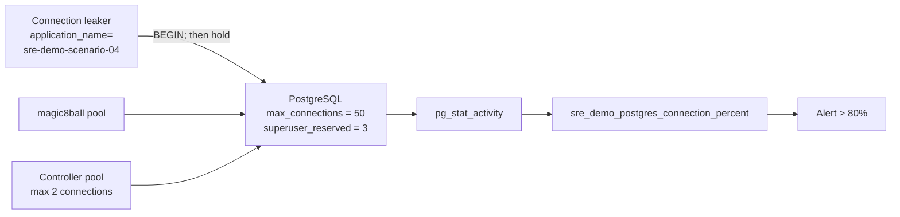

# Scenario 04 — PostgreSQL connection exhaustion

| | |
|---|---|
| **ID** | 04 |
| **Component** | PostgreSQL VM |
| **Severity** | Critical |
| **Alert rule** | `SRE Demo 04 - PostgreSQL connection utilisation` |
| **Time to symptom** | 5–15 seconds |
| **Time to alert** | 3–5 minutes |

---

## The story

A service ships with a connection pool that acquires connections but never returns them —
a missing `finally`, a swallowed exception, a transaction left open on an error path.

At low traffic nobody notices. As usage grows, the leak outruns the idle timeout. Connection
count climbs until it reaches `max_connections`, and then *every* client is refused — including
services that have nothing to do with the one that leaked.

The database is healthy. The host is healthy. The network is healthy. Everything is refused
anyway. This is one of the most instructive database incidents there is, because the component
that fails is not the component at fault.

---

## Architecture involved



`max_connections` is deliberately low (50) so saturation happens in seconds rather than hours,
and the leak stops short of the ceiling so the incident stays diagnosable.

---

## How to activate

**Console:** scenario card 04 → **Inject failure**.

**API:**

```bash
curl -X POST http://<app-vm-ip>:8080/api/scenarios/04/activate
```

The controller opens connections as the dedicated `sre_scenario` role, issues `BEGIN`, and then
holds them — leaving sessions **idle in transaction**, the classic signature of a leak. Every
session sets `application_name = 'sre-demo-scenario-04'`.

That label does two jobs: it is the clue that identifies the offender in `pg_stat_activity`, and
it is the filter that lets reset terminate only this lab's sessions.

---

## Expected symptoms

| Where | What you see |
|---|---|
| Scenario Controller | PostgreSQL card DEGRADED then UNHEALTHY, showing e.g. 41/50 (82%) |
| Magic 8 Ball UI | Answers still work; the history panel warns the database is unavailable |
| Application Insights | `AppDependencies` of type PostgreSQL start failing |
| `pg_stat_activity` | Dozens of sessions named `sre-demo-scenario-04`, state `idle in transaction` |
| PostgreSQL logs | `FATAL: sorry, too many clients already` |

Note that Magic 8 Ball keeps answering. It degrades rather than fails, which is deliberate — and
it means the *user-visible* symptom is subtler than the telemetry, as it usually is in reality.

---

## Expected Azure alert

**`SRE Demo 04 - PostgreSQL connection utilisation`**, severity 1, threshold 80%:

```kusto
AppMetrics
| where Name == "sre_demo_postgres_connection_percent"
| extend Value = iif(ItemCount > 0, Sum / ItemCount, Sum)
| summarize ConnectionPercent = max(Value)
```

---

## Investigation clues

```kusto
// Connection utilisation climbing
AppMetrics
| where Name in ("sre_demo_postgres_active_connections", "sre_demo_postgres_connection_percent")
| extend Value = iif(ItemCount > 0, Sum / ItemCount, Sum)
| summarize avg(Value) by Name, bin(TimeGenerated, 1m)
| render timechart
```

```kusto
// Dependency failures, and note the target is reachable
AppDependencies
| where DependencyType has "postgre"
| summarize Total = count(), Failed = countif(Success == false) by bin(TimeGenerated, 5m)
| extend FailurePercent = 100.0 * Failed / Total
```

**The decisive evidence** is on the database itself:

```sql
-- Who is holding connections?
SELECT application_name, state, count(*)
FROM pg_stat_activity
GROUP BY application_name, state
ORDER BY count(*) DESC;

-- How close to the ceiling?
SELECT count(*) AS active,
       current_setting('max_connections')::int AS max_conn,
       round(100.0 * count(*) / current_setting('max_connections')::int, 1) AS pct
FROM pg_stat_activity;

-- How long have the leaked sessions been idle?
SELECT pid, application_name, state,
       now() - state_change AS idle_duration,
       now() - xact_start   AS transaction_age
FROM pg_stat_activity
WHERE application_name LIKE 'sre-demo-scenario%'
ORDER BY xact_start;
```

From the App VM:

```bash
ssh -i .secrets/lab_<suffix>_ed25519 sreadmin@<app-vm-ip>
nc -zv <postgres-private-ip> 5432     # TCP CONNECTS — this is not a network problem
```

**The chain of reasoning:** application dependency failures → TCP connects fine → the server is
up and answering → connection count is at the ceiling → one `application_name` holds most of
them → those sessions are idle in transaction → a connection leak, not a capacity problem.

---

## Distinguishing scenario 04 from scenario 05

Both present as "the application cannot reach the database". The differentiator is a single
observation:

| Observation | Scenario 04 (connections) | Scenario 05 (network) |
|---|---|---|
| TCP connect to 5432 | **Succeeds** | **Times out** |
| Server response | `FATAL: too many clients` | No response at all |
| Failure mode | Refused at the application layer | Dropped at the network layer |
| `pg_stat_activity` | Reachable and informative | Unreachable from clients |

Connection *refused or rejected* means something is listening. Connection *timed out* means
packets are being dropped. That distinction resolves the incident in seconds.

---

## Expected root cause

A client is leaking PostgreSQL connections: sessions are opened, a transaction is begun, and
neither is ever closed. Accumulated leaked sessions consume nearly all of `max_connections`, so
legitimate clients are refused.

The database is not undersized and not unhealthy. The consumer is defective.

---

## Expected remediation

**Immediate**

```sql
-- Terminate ONLY the leaked sessions, matched on application_name
SELECT pg_terminate_backend(pid)
FROM pg_stat_activity
WHERE application_name LIKE 'sre-demo-scenario%'
  AND pid <> pg_backend_pid();
```

Then restart the leaking client so it rebuilds a clean pool.

> Never `pg_terminate_backend` indiscriminately. Always filter to the identified offender —
> `application_name`, `client_addr` or `usename`. Terminating every session turns a partial
> incident into a total outage.

**Root cause**

- Return connections to the pool in a `finally` block, or use the language's scoped/`using`
  construct so release cannot be skipped on an error path.
- Set a bounded pool size, plus `idle_in_transaction_session_timeout` on the server as a backstop.
- Alert on connection utilisation *and* on `idle in transaction` duration.
- Consider PgBouncer if many services share one database.

---

## How to verify recovery

| Check | Passing condition |
|---|---|
| PostgreSQL TCP endpoint reachable | Connects |
| Connection usage back to baseline | Under 50% of `max_connections` |
| No scenario sessions remain | Zero sessions named `sre-demo-scenario-04` |
| Administrative headroom preserved | Active count below maximum throughout |

```bash
curl -s http://<app-vm-ip>:8080/api/scenarios/04/telemetry | jq
```

---

## How to reset manually

```bash
curl -X POST http://<app-vm-ip>:8080/api/scenarios/04/reset
```

Reset closes the connections it opened, then terminates any strays server-side — matched
strictly on `application_name`, so sessions belonging to Magic 8 Ball or the controller are never
touched.

Directly on the database VM (reachable only from the App VM):

```bash
ssh -i .secrets/lab_<suffix>_ed25519 sreadmin@<app-vm-ip>
ssh <postgres-private-ip>
sudo -u postgres psql -c "SELECT pg_terminate_backend(pid) FROM pg_stat_activity WHERE application_name LIKE 'sre-demo-scenario%' AND pid <> pg_backend_pid();"
```

---

## Safety limits

| Limit | Value | Why |
|---|---|---|
| `max_connections` | 50 | Low enough to saturate quickly, high enough to administer |
| `superuser_reserved_connections` | 3 | PostgreSQL always keeps superuser slots free |
| Scenario headroom | 6 (`POSTGRES_LEAK_HEADROOM`) | Additional reserve on top of the superuser slots |
| Controller pool size | 2 | The control plane cannot be starved by its own scenario |
| Session labelling | `application_name = 'sre-demo-scenario-04'` | Reset can target exactly what it created |
| Termination filter | `LIKE 'sre-demo-scenario%'` only | Unrelated sessions are never terminated |
| Automatic timeout | 30 minutes | Unattended scenarios self-reset |

**Why the leak stops short of the ceiling.** Consuming the last connection would lock out the
diagnosis itself — no `psql`, no `pg_stat_activity`, no reset. Leaving roughly nine slots free
(3 superuser + 6 headroom) means the incident is severe enough to alert on and investigate, and
still recoverable. Production systems reserve connections for exactly this reason.

---

## Suggested SRE Agent prompt

```
Investigate the database errors affecting the application.
Determine whether PostgreSQL is healthy and identify why clients
cannot establish connections.
```
