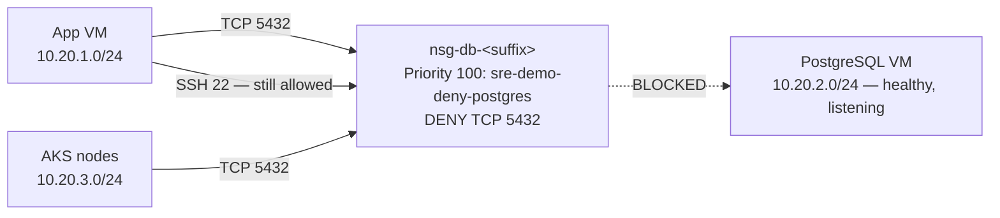

# Scenario 05 — Network / NSG failure

| | |
|---|---|
| **ID** | 05 |
| **Component** | Networking — database subnet NSG |
| **Severity** | Critical |
| **Alert rule** | `SRE Demo 05 - PostgreSQL dependency failures` |
| **Time to symptom** | 10–30 seconds |
| **Time to alert** | 3–5 minutes |

---

## The story

Someone tightens network security. The intent is reasonable — restrict who can reach the
database subnet. The rule is written slightly too broadly, or at a higher priority than the
existing allow rules, and it is applied outside a change window.

Applications immediately lose the database. Every instinct says "the database is down", so the
first half hour is spent looking at a database that is, in fact, completely healthy: the VM is
running, PostgreSQL is listening, there is nothing in its logs.

Nothing is wrong with any *service*. The packets simply never arrive.

---

## Architecture involved



The database NSG normally allows 5432 from the app and AKS subnets at priorities 200 and 210,
with a catch-all deny at 4000. The injected rule sits at **priority 100** — above the allows —
and matches only TCP 5432.

---

## How to activate

**Console:** scenario card 05 → **Inject failure**.

**API:**

```bash
curl -X POST http://<app-vm-ip>:8080/api/scenarios/05/activate
```

The controller calls Azure Resource Manager with its managed identity and creates:

```json
{
  "name": "sre-demo-deny-postgres",
  "properties": {
    "protocol": "Tcp",
    "destinationPortRange": "5432",
    "sourceAddressPrefixes": ["10.20.1.0/24", "10.20.3.0/24"],
    "access": "Deny",
    "priority": 100,
    "direction": "Inbound"
  }
}
```

---

## Expected symptoms

| Where | What you see |
|---|---|
| Scenario Controller | PostgreSQL card UNHEALTHY — "TCP 5432 unreachable: connection timed out" |
| Magic 8 Ball UI | Answers still work; history unavailable (graceful degradation) |
| Application Insights | `sre_demo_postgres_connectivity` drops to 0; PostgreSQL dependencies fail |
| PostgreSQL VM | Running, healthy, listening — **no errors in its logs at all** |
| Azure activity log | An NSG write operation at the moment symptoms began |

The absence of database-side errors is the strongest clue available. A database refusing
connections logs the refusals. A database nobody can reach logs nothing, because from its point
of view nothing happened.

---

## Expected Azure alert

**`SRE Demo 05 - PostgreSQL dependency failures`**, severity 1:

```kusto
let probe = AppMetrics
    | where Name == "sre_demo_postgres_connectivity"
    | extend Value = iif(ItemCount > 0, Sum / ItemCount, Sum)
    | summarize Failures = countif(Value < 1);
let deps = AppDependencies
    | where DependencyType has "postgre" or Target has "postgres" or Name has "postgres"
    | summarize Failures = countif(Success == false);
union probe, deps
| summarize FailedProbes = sum(Failures)
```

---

## Investigation clues

```kusto
// Connectivity flips from 1 to 0 at a precise moment
AppMetrics
| where Name == "sre_demo_postgres_connectivity"
| extend Value = iif(ItemCount > 0, Sum / ItemCount, Sum)
| summarize min(Value) by bin(TimeGenerated, 1m)
| render timechart
```

```kusto
// Note the latency: timeouts, not fast refusals
AppDependencies
| where DependencyType == "PostgreSQL"
| summarize Failed = countif(Success == false), AvgMs = avg(DurationMs) by bin(TimeGenerated, 5m)
```

A refused connection returns in milliseconds. A dropped packet takes the full timeout. That
timing difference alone separates this scenario from scenario 04.

**Azure configuration:**

```bash
# The rule itself
az network nsg rule list -g <rg> --nsg-name <db-nsg> \
  -o table --query "[].{Name:name,Priority:priority,Access:access,Port:destinationPortRange}"

# When was it created, and by whom?
az monitor activity-log list -g <rg> --offset 1h \
  --query "[?contains(resourceId,'networkSecurityGroups')].{Time:eventTimestamp,Op:operationName.value,Caller:caller}" -o table
```

Expected output — the injected rule sits above the allows:

```
Name                      Priority  Access  Port
sre-demo-deny-postgres     100      Deny    5432     <-- evaluated first
Allow-Postgres-From-App    200      Allow   5432
Allow-Postgres-From-AKS    210      Allow   5432
Allow-SSH-From-App         220      Allow   22
Deny-Other-Vnet-Inbound   4000      Deny    *
```

**From the App VM** — proving it is the network and not the service:

```bash
ssh -i .secrets/lab_<suffix>_ed25519 sreadmin@<app-vm-ip>

nc -zv -w 5 <postgres-private-ip> 5432   # times out
ping -c 3 <postgres-private-ip>          # also blocked, but 5432 is the specific failure
ssh <postgres-private-ip>                # SSH still works — the VM is fine
```

Then, from the database VM itself:

```bash
sudo systemctl status postgresql         # active (running)
sudo ss -tlnp | grep 5432                # listening on 0.0.0.0:5432
sudo -u postgres psql -c "SELECT 1"      # works locally
sudo tail -50 /var/log/postgresql/*.log  # no errors — nothing is arriving
```

**The chain of reasoning:** app cannot reach the database → the VM is healthy → the service is
healthy and listening → it works locally → TCP times out from clients → SSH to the same host
works → therefore a port-specific network filter → check NSG rules → `sre-demo-deny-postgres`
at priority 100.

---

## Expected root cause

An NSG rule named `sre-demo-deny-postgres` was added to the database subnet's network security
group at priority 100, denying TCP 5432 from the application and AKS subnets. Because NSG rules
are evaluated in priority order and the first match wins, it overrides the existing allow rules
at 200 and 210.

This is a configuration change, not a failure. Nothing crashed.

---

## Expected remediation

**Immediate — remove the rule:**

```bash
az network nsg rule delete \
  --resource-group <rg> \
  --nsg-name <db-nsg> \
  --name sre-demo-deny-postgres
```

Connectivity is restored within seconds; no restart is required anywhere.

**Then validate the full path:**

```bash
nc -zv <postgres-private-ip> 5432                          # TCP
psql -h <postgres-private-ip> -U sre_app -d sre_demo -c "SELECT 1"   # authentication
curl -s http://<app-vm-ip>:8080/api/lab/status | jq '.components[] | select(.name=="PostgreSQL")'
curl -s http://<magic8ball-ip>/api/history | jq '.available'          # dependency healthy
```

**Root cause follow-up**

- Require change control for NSG modifications; use Azure Policy to deny or audit rules below a
  reserved priority band.
- Enable NSG flow logs — they would have shown the denied flows immediately.
- Use Application Security Groups instead of raw CIDRs to make intent explicit.
- Alert on NSG write operations against production subnets.

---

## How to verify recovery

| Check | Passing condition |
|---|---|
| Deny rule removed | `sre-demo-deny-postgres` does not exist |
| PostgreSQL reachable on TCP 5432 | Connects |
| Controller management path unaffected | Was never blocked at any point |

---

## How to reset manually

```bash
curl -X POST http://<app-vm-ip>:8080/api/scenarios/05/reset

# or directly
az network nsg rule delete -g <rg> --nsg-name <db-nsg> -n sre-demo-deny-postgres
```

`scripts/reset-lab.sh` also removes this rule, and does so directly against Azure — so it works
even if the controller is unreachable.

---

## Safety limits

| Limit | Value | Why |
|---|---|---|
| Protocol and port | TCP 5432 only | Nothing else is affected |
| Sources | App and AKS subnets only | Scoped to demo workloads |
| Target NSG | The lab's database NSG only | No other NSG is ever read or written |
| SSH | Never blocked | The VMs stay reachable for diagnosis |
| Controller traffic | Never blocked | The lab always remains resettable |
| Rule name | Fixed: `sre-demo-deny-postgres` | Unambiguous to find and to remove |
| Azure permissions | Contributor on the demo resource group only | Cannot alter anything outside the lab |
| Automatic timeout | 60 minutes | Unattended scenarios self-reset |

**Why this is safe to demonstrate.** A network fault sounds alarming to inject, and it would be
if it were broad. This one is a single rule, on one NSG, matching one protocol and one port,
from two known subnets. Management access is untouched by construction — which is what
guarantees you can always reach the controller to press Reset.

---

## Suggested SRE Agent prompt

```
Investigate why the application cannot communicate with PostgreSQL.
Check application health, database health, routing and NSG configuration.
```
