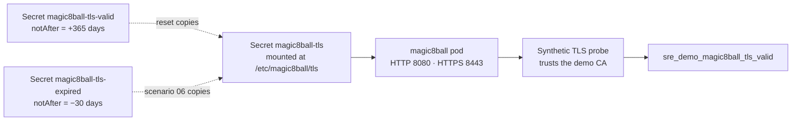

# Scenario 06 — TLS certificate expiration

| | |
|---|---|
| **ID** | 06 |
| **Component** | AKS — `magic8ball` TLS secret |
| **Severity** | High |
| **Alert rule** | `SRE Demo 06 - Magic 8 Ball TLS validation failing` |
| **Time to symptom** | 20–40 seconds (rollout time) |
| **Time to alert** | 3–5 minutes |

---

## The story

A certificate was issued two years ago by someone who has since left. It was renewed once,
manually. The reminder went to a shared mailbox nobody reads.

It expires at midnight. Nothing crashes. Every pod is Ready, every health check passes, CPU and
memory are normal, and the application is working perfectly — as long as you speak to it over
plain HTTP.

Every HTTPS client, which is to say every real client, now refuses to talk to it.

This is the incident where all the usual dashboards are green and the service is completely
unusable, and it catches experienced teams regularly.

---

## Architecture involved



Both certificate pairs are pre-loaded into the cluster at deployment time. The scenario only
ever **copies between existing secrets**, so no private key passes through the controller or the
runner, and the operation is idempotent.

**The synthetic checker explicitly trusts the demo CA.** This matters: without it, every failure
would read as "unknown issuer" and the exercise would become a trust-store puzzle. Because the
CA is trusted, the *only* thing wrong is the validity window — which makes this unambiguously a
certificate-expiry investigation.

---

## How to activate

**Console:** scenario card 06 → **Inject failure**.

**API:**

```bash
curl -X POST http://<app-vm-ip>:8080/api/scenarios/06/activate
```

`scenario-runner` copies `tls.crt` and `tls.key` from `magic8ball-tls-expired` into the active
`magic8ball-tls` secret, annotates it `sre-demo/cert-variant=expired`, and restarts the
deployment so the new material is loaded.

---

## Expected symptoms

| Where | What you see |
|---|---|
| Scenario Controller | TLS card UNHEALTHY — "certificate expired on \<date\>" |
| Browser over HTTPS | `NET::ERR_CERT_DATE_INVALID` |
| `curl https://...` | `SSL certificate problem: certificate has expired` |
| `curl http://...` | **200 OK — works perfectly** |
| `kubectl get pods` | All Running, all Ready, zero restarts |
| Application Insights | `sre_demo_magic8ball_tls_valid` = 0, while `sre_demo_magic8ball_http_success` = 1 |

Two metrics disagreeing is the signature of this scenario: the application is healthy and the
transport is broken.

---

## Expected Azure alert

**`SRE Demo 06 - Magic 8 Ball TLS validation failing`**, severity 1:

```kusto
AppMetrics
| where Name == "sre_demo_magic8ball_tls_valid"
| extend Value = iif(ItemCount > 0, Sum / ItemCount, Sum)
| summarize FailedTlsChecks = countif(Value < 1)
```

---

## Investigation clues

```kusto
// TLS fails while HTTP succeeds — the whole diagnosis in one chart
AppMetrics
| where Name in ("sre_demo_magic8ball_tls_valid", "sre_demo_magic8ball_http_success")
| extend Value = iif(ItemCount > 0, Sum / ItemCount, Sum)
| summarize avg(Value) by Name, bin(TimeGenerated, 1m)
| render timechart
```

```kusto
// Days remaining goes negative
AppMetrics
| where Name == "sre_demo_magic8ball_tls_days_remaining"
| extend Value = iif(ItemCount > 0, Sum / ItemCount, Sum)
| summarize min(Value) by bin(TimeGenerated, 5m)
```

```kusto
// Pods are fine — rules out the obvious suspects
KubePodInventory
| where Namespace == "sre-demo" and Name startswith "magic8ball"
| summarize arg_max(TimeGenerated, PodStatus, ContainerRestartCount) by Name
```

**Inspect the certificate directly:**

```bash
echo | openssl s_client -connect <magic8ball-ip>:443 2>/dev/null \
  | openssl x509 -noout -dates -subject -issuer
```

```
notBefore=Jul 28 16:25:56 2025 GMT
notAfter=Jul 28 16:25:56 2026 GMT      <-- in the past
subject=C = US, O = Azure SRE Agent Demo Lab, CN = magic8ball.sre-demo.local
issuer=C = US, O = Azure SRE Agent Demo Lab, CN = SRE Demo Lab Root CA
```

**Prove expiry is the only fault** — this is the decisive test:

```bash
# Fails with time checking on
openssl verify -CAfile certs/ca.crt <(echo | openssl s_client -connect <ip>:443 2>/dev/null | openssl x509)

# Succeeds with time checking disabled -> the chain is valid, only the dates are wrong
openssl verify -no_check_time -CAfile certs/ca.crt <(...)
```

```bash
# Kubernetes side
kubectl -n sre-demo get secret magic8ball-tls -o jsonpath='{.metadata.annotations}' | jq
kubectl -n sre-demo get secret magic8ball-tls -o jsonpath='{.data.tls\.crt}' | base64 -d | openssl x509 -noout -dates
kubectl -n sre-demo get pods -l app=magic8ball        # Ready 1/1
curl -s http://<magic8ball-ip>/healthz                # 200
```

**The chain of reasoning:** HTTPS checks failing → pods Ready and not restarting → HTTP returns
200 → so the application is healthy → the TLS handshake completes but validation fails → the
certificate chains correctly to a trusted CA → `notAfter` is in the past → the certificate
expired.

---

## Expected root cause

The TLS certificate served by Magic 8 Ball expired roughly 30 days ago. The Kubernetes secret
`magic8ball-tls` contains a certificate whose validity window has passed, so every client that
validates certificates refuses the connection.

The application, the pods and the cluster are all healthy. Only the certificate is invalid.

---

## Expected remediation

**Immediate — install the valid certificate and reload:**

```bash
CRT=$(kubectl -n sre-demo get secret magic8ball-tls-valid -o jsonpath='{.data.tls\.crt}')
KEY=$(kubectl -n sre-demo get secret magic8ball-tls-valid -o jsonpath='{.data.tls\.key}')

kubectl -n sre-demo patch secret magic8ball-tls --type=merge \
  -p "{\"data\":{\"tls.crt\":\"${CRT}\",\"tls.key\":\"${KEY}\"},\"metadata\":{\"annotations\":{\"sre-demo/cert-variant\":\"valid\"}}}"

kubectl -n sre-demo rollout restart deployment/magic8ball
kubectl -n sre-demo rollout status deployment/magic8ball
```

The restart is required because the certificate is read at process start.

**Root cause follow-up**

- Automate issuance and renewal — cert-manager in-cluster, or Azure Key Vault with rotation.
- Alert on `daysRemaining < 30`, not on expiry. The lab already publishes
  `sre_demo_magic8ball_tls_days_remaining` for exactly this.
- Inventory every certificate with a named owner.
- Watch the secret and reload without a restart, so renewal is not a deployment event.

---

## How to verify recovery

| Check | Passing condition |
|---|---|
| Valid certificate installed | `notAfter` is in the future |
| HTTPS handshake succeeds | Chain validates against the demo CA |
| Application healthy over HTTP | `/healthz` returns 200 |
| Pods Ready | At least one replica Ready |

```bash
curl --cacert certs/ca.crt --resolve magic8ball.sre-demo.local:443:<magic8ball-ip> \
  https://magic8ball.sre-demo.local/healthz
```

---

## How to reset manually

```bash
curl -X POST http://<app-vm-ip>:8080/api/scenarios/06/reset
```

Or use the patch commands above. `scripts/reset-lab.sh` performs the same restoration directly
against Kubernetes.

---

## Safety limits

| Limit | Value | Why |
|---|---|---|
| Certificate scope | The demo CA only | Never a public or corporate CA |
| Blast radius | The `magic8ball-tls` secret in `sre-demo` | No other secret is read or written |
| Valid pair | Always present in-cluster | Recovery never depends on reissuing anything |
| Liveness probe | **HTTP, not HTTPS** | Pods are not restarted, so evidence is preserved |
| Key material | Never leaves the cluster | The runner copies between secrets; nothing transits the controller |
| RBAC | Named secrets only | The Role lists the three secret names explicitly |
| Automatic timeout | 60 minutes | Unattended scenarios self-reset |

**Why the probes use HTTP.** Had liveness used HTTPS, Kubernetes would have judged the pods
unhealthy and restarted them repeatedly. The incident would present as `CrashLoopBackOff`,
the real cause would be buried under restart noise, and a five-minute diagnosis would become an
hour. That is a genuine production lesson hiding inside this scenario: probe the *application*,
not the transport in front of it.

**Why a private CA.** The lab must deploy into any subscription with no domain, no DNS control
and nothing to purchase. A local CA gives a real certificate with real validity dates and a real
handshake failure, with none of those prerequisites.

**Using a real certificate instead.** For a lab with a real domain, the same scenario works with
Azure Key Vault and cert-manager: store both a valid and an expired certificate in Key Vault,
sync them with the Secrets Store CSI driver, and swap the referenced version. The investigation
is identical; only issuance changes.

---

## Suggested SRE Agent prompt

```
Investigate why HTTPS health checks for Magic 8 Ball are failing even
though the AKS pods appear healthy.
```
